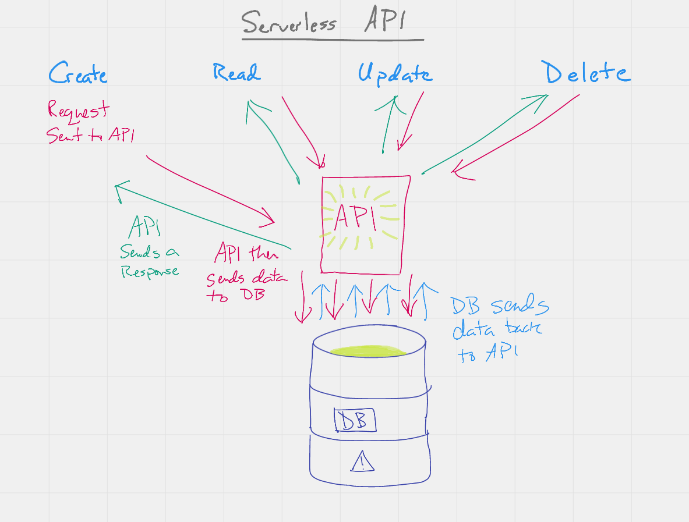

# serverless-api

## Author: Dan Engel

[Root URL](https://01g4o5ol6l.execute-api.us-west-2.amazonaws.com/people)

---

### Routes

#### Post

1. Go to [swagger](https://inspector.swagger.io/builder) and enter the root url (https://01g4o5ol6l.execute-api.us-west-2.amazonaws.com/people)
1. Select *Post* and in the body add something formatted like this
  `{ "id": "d0cf9e12-cba0-4651-88e4-9sgradgzceb9", "name": "test name999", "phone": "222-222-2999"}`.
1. Click send and the response should show the data in the window below.

#### Get

1. Go to [swagger](https://inspector.swagger.io/builder) and enter the root url (https://01g4o5ol6l.execute-api.us-west-2.amazonaws.com/people)
1. Select *Get* and click send. You should see all the items in the database below.
1. Highlight an ID and copy it for the next step

#### Put

1. Go to [swagger](https://inspector.swagger.io/builder) and enter the root url (https://01g4o5ol6l.execute-api.us-west-2.amazonaws.com/people)
1. In the URL, add `?id=` plus the ID you just copied.
1. In the body, add the same formatted data as above along with the same ID you pasted into the URL, but change some data. This will be the new item info.
1. Select *Put* and click send. You should see all the items in the database below.

#### Delete

1. Go to [swagger](https://inspector.swagger.io/builder) and enter the root url (https://01g4o5ol6l.execute-api.us-west-2.amazonaws.com/people)
1. IN the URL, add `?id=` plus the ID you just copied.
1. Select *Delete* and click send. You should see `contact successfully deleted`.

### UML

